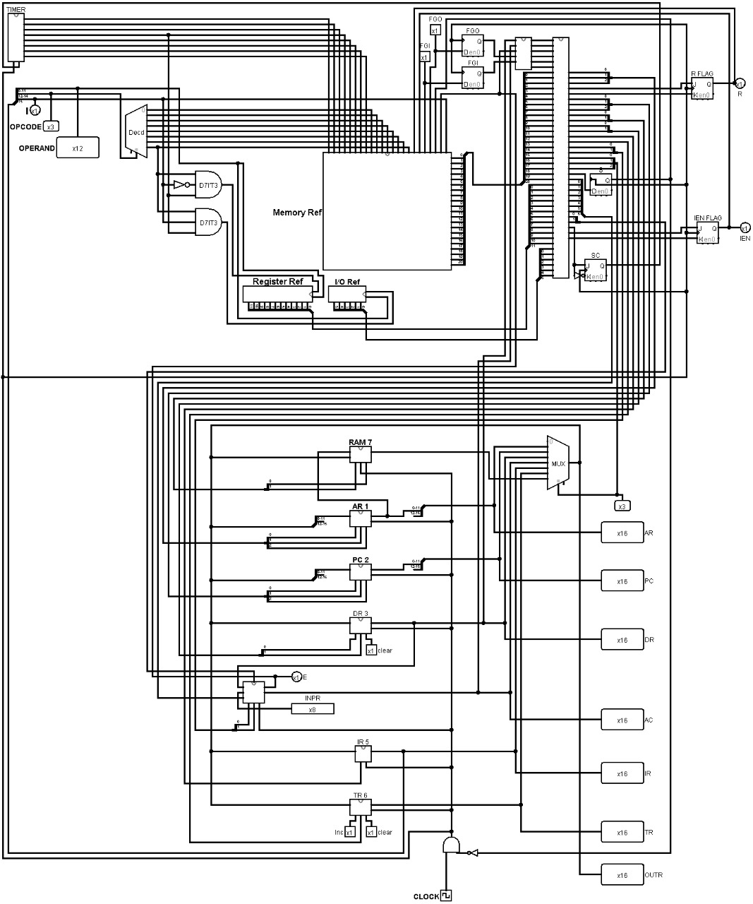

# computer1
UNDER , the guidance of HOD DR Alok sir ,I have made hardwired computer and implemented everything from scratch and assembled circuit on logism,
As part of my interest in core Computer Science fundamentals, I built a Hardwired Computer Architecture project based on the design outlined in "Digital Design and Computer Architecture" by Morris Mano. The project involved implementing each component of a simple hardwired CPU using Logisim, a digital circuit simulation tool.

I designed and connected all major components—including the Program Counter, Instruction Register, Control Unit, ALU, Memory Unit, and Registers—to simulate instruction execution at the hardware level. The control unit was implemented using a hardwired logic approach, ensuring that the CPU could correctly decode and execute instructions step-by-step based on control signals.

This project gave me a hands-on understanding of how low-level operations in a CPU are coordinated, deepening my appreciation for how software and hardware interact at the architectural level. It also sharpened my debugging skills and attention to timing and data flow within a system.

